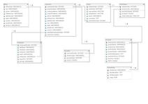

We all love Google for its easiness to access to any document available on web. It just requires a couple of words to find the most relevant article around it. Moreover, as you start searching it even completes the words for you. 

**What if you can do so for records in your databases?**

This article shows how we can easily create a google like search feature for searching in relational databases using secondary indexes. Secondary Indexes can be understood as metadata, which contains information about each field of every record in a database. I would be using macOs for this demonstration.

We are going to cover the following things in this article.
## Contents
* Software Stack
* Installation
* Load Data
* Create Secondary Index
* What is Redis
* Features
* Conclusion

### Software Stack
* MySQL: Persistent storage of actual database and secondary index.
* Redis: An in-memory database which helps in caching frequent searches and reduces search latency.
* Docker: Containers for both Mysql and Redis for easy installation and scalability.
* Python: Base coding language.

### Installation

Firstly you need to download [docker](https://www.docker.com/get-started). To check if it has installed properly, just type the following in CLI.

```
>> docker -v
Docker version 18.09.0, build 4d60db4
```

After installing docker, we need to download mysql and redisearch docker containers to start. We can also you use [kitematic](https://kitematic.com/) for easy docker container setup. Start both redis and mysql containers now.

To have easier interaction with MySQL database, we opt for workbench [community edition](https://dev.mysql.com/downloads/workbench/) which is free to use under GPL license. And for redis, we can use Redis Desktop Manager (RDM) which however comes with a price.

### Load Data
<a href="../images/auto-completion/ClassicModelsDBSchema.jpg"> {: .align-right}</a>

You can find the sample database [here](https://github.com/umang-singhal/autocomplete-structured-data). It consists of auto-mobile sales and payment transactions from various US states. Learn more about it [here](http://www.eclipse.org/birt/documentation/sample-database.php).

There are two files, in mysql directory namely `create_classicmodels.sql` and `load_classicmodels.sql` in the [repository](https://github.com/umang-singhal/autocomplete-structured-data), which you can use to create tables and load data into them. You can also use workbench's import wizard for loading data into respective tables using the files in `datafiles` directory.

### Create Secondary Index
Next, we move to creating secondary indexes of the data using `createSecondaryIndex.py` [script](https://github.com/umang-singhal/autocomplete-structured-data/blob/master/createSecondaryIndex.py) in the base directory. Before that, we shall see the configurations needed for it to work. 

```conf
[mysql]
USER_NAME = root
PASSWORD = 
HOST_NAME = localhost
PORT = 3306
DB_NAME = birt

[sec-index]
USER_NAME = root
PASSWORD = 
HOST_NAME = localhost
PORT = 3306
DB_NAME = search
```

We require two mysql connections, one for getting data and another for storing our secondary index. We need to make sure that the two databases mentioned are already created.

Now, Let's have a look at index creation and I'll discuss each part's functionality briefly.
#### Imports
```python
import pandas as pd
from configparser import ConfigParser
from sqlalchemy import create_engine
import argparse
```
We require `argparse` to parse cli argument. `Pandas` and `sqlalchemy` are used for reading data from mysql. `configparser` makes it easy to read configuration file within py script.

#### MySQL Connection
```python
# make connection
def mysql_engine(type):
    if type == "index":
        mysql = conf["sec-index"]
    elif type == "data":
        mysql = conf["mysql"]

    user_name = mysql["USER_NAME"]
    pwd = mysql.get("PASSWORD", '')
    host = mysql.get("HOST_NAME", "localhost")
    port = mysql["PORT"]
    db = mysql["DB_NAME"]
    engine = create_engine(f"mysql+pymysql://{user_name}:{pwd}@{host}:{port}/{db}?charset=utf8mb4")
    return engine
```
`mysql_engine` helps to create a engine for the given `type` (data or index). `pymysql` client establishes connection with mysql database.

#### Parsing Dataset
```python
def parse_table(table):
    ...
```

**I'll break this method in parts and explain each one individually.**

* Create Connection to source data
```python
try:
    engine = mysql_engine("data")
    conn = engine.connect()
except Exception as e:
    logger.debug(f"Unable to connect to database.\nError: {e}")
    return
```

* Delete existing index records of the same source table
```python
# delete index if exists for the table and re-create it
try:
    engine.execute(f"delete from sec_index where dataset='{table}'")
except Exception as e:
    logger.debug(e)
```

* Read data into DataFrame(DF) and create an empty DF for secondary index
```python
df = pd.read_sql(f"select * from {table} limit 10", conn);
secondary_index = pd.DataFrame([], columns=["key", "completion", "column", "dataset"])
```

* Create Index entry for each _column_ and, _values_ from columns with string data-type.
```python
i = 0 # idx locator
-- Put All Columns, Infer data types
for x in df.columns:
    secondary_index.loc[i] = [x, x, "", table]
    i+=1
-- iterate over categorical columns and add each value to index dataframe
catCols = df.select_dtypes(include=object).columns
for column in catCols:
    distinct_values = df[column].unique()
    for value in distinct_values:
        keys = value.split()
        for key in keys:
            secondary_index.loc[i] = [key, value, column, table]
            i+=1
```
The first for-loop takes all the columns and adds it to index df. Next, we find unique values in each string based columns. We split each value on `space` and add one entry for each token so that we can efficiently search on sub-strings.

* Store Index
```python
# store secornday index in mysql
try:
    index_engine = mysql_engine("index")
    index_conn = index_engine.connect()
    secondary_index.to_sql("sec_index", index_conn, if_exists="append")
except Exception as e:
    logger.debug(f"Unable to store index due to: {e}")
```

To run this script, We need to run `python createSecondaryIndex.py <tableName>` command on cli. The script needs to be done for each table in the database.

### What is Redis?

Redis is an open-source in-memory database which is generally used as cache or message broker system. In our application, we use it as cache to store results of frequent queries to lessen the suggestion time for auto-completion. We actually use a special module of redis called `RediSearch`. As the name suggests, it is a specially designed module to support various functions for search using secondary indexes. We are using the `redis 2.10.6` and `redisearch 0.7.1` versions for demo.

I hope you find this tutorial helful.

... 
{: .text-center}